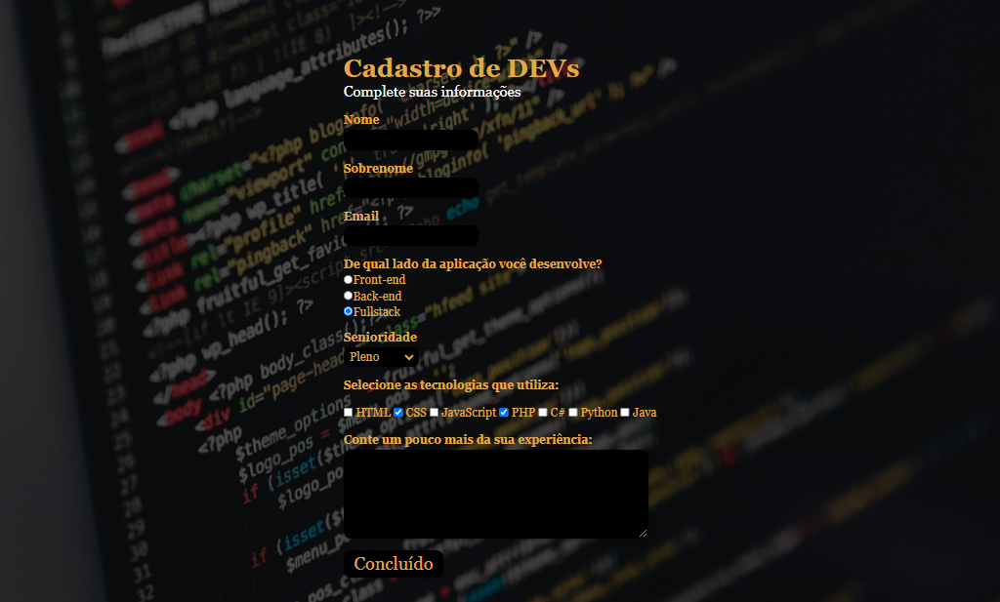

<h1 align="center" id="project_name">
   
  Pagina pessoal
    
  
   
</h1>

Aqui vai uma linha do tempo desde a primeira pagina pessoal que fiz para mim.

<h2 id="about">
💻 Sobre o projeto
</h2>
Sabemos a necessidade de um profissional ter o seu próprio site, me vi na oportunidade de criar o meu próprio enquanto praticava meus estudos de programação, e a partir dai foi tentativa atras de tentativa. No inicio fui copiando videos do youtube, mas não estava me agradando muito, então, a partir da segunda pagina, passei a estudar sobre design, paletas de cores, fontes, etc. Acompanhe minha evolução.
 

<h2 id="layout">🎨 Layout</h2>

 
  Primeira página 
    
  
 
 
  Segunda página 
    
  
 
 
  Terceira página 
    
  
  
  Pagina atual
    
  
 

 
<h2 id="technologies">🛠 Tecnologias</h2>

As seguintes ferramentas foram usadas na construção do projeto:

- **[HTML](https://exemplo.com)**
- **[CSS](https://exemplo.com)**
- **[JS](https://exemplo.com)**

> Veja minha pagina atual [Maddu](https://maddusilva.github.io/formulario/)

**Utilitários**

- Editor: **[Visual Studio Code](https://code.visualstudio.com/)**
- Hospedagem: **[GitHub Pages](https://pages.github.com/)**
- Fontes: **font-family: 'Noto Sans Display', sans-serif;**

<h2 id="author">🦸 Autor</h2>
<a href="#">

 <b> Maria Eduarda da Silva </b></a>

 <h2 id="author">Social</h2>
<a href="#">

 

 

*Made with love ♡ by Maddu* 👋🏽 [Entre em contato!](https://www.linkedin.com/in/maddusilvadev/)

